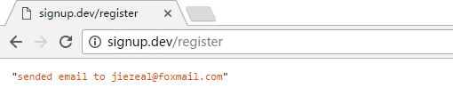

#使用事件触发

UserController.php
```
public function store(UserSignUpRequest $request){
    $data = [
        'name' => $request->get('name'),
        'email' => $request->get('email'),
        'password' => bcrypt($request->get('password'))
    ];

    User::register($data);

    return redirect('/success');
}
```

User.php
```
/**
 * @param array $attributes
 * @return mixed
 */
public static function register(array $attributes)
{
    $user = static::create($attributes);

    event(new UserRegistered($user));

    return $user;
}
```

app/Providers/EventServiceProvider.php
```
protected $listen = [
    'App\Events\UserRegistered' => [
        'App\Listeners\SendWelcomeEmail',
    ],
];
```

php artisan event:generate

app/Events/UserRegistered.php
```
public $user;

public function __construct(User $user)
{
    $this->user = $user;
}
```

app/Listeners/SendWelcomeEmail.php
```
public function handle(UserRegistered $event)
{
    dd('sended email to '.$event->user->email);
}
```
通过浏览器注册一个用户：
