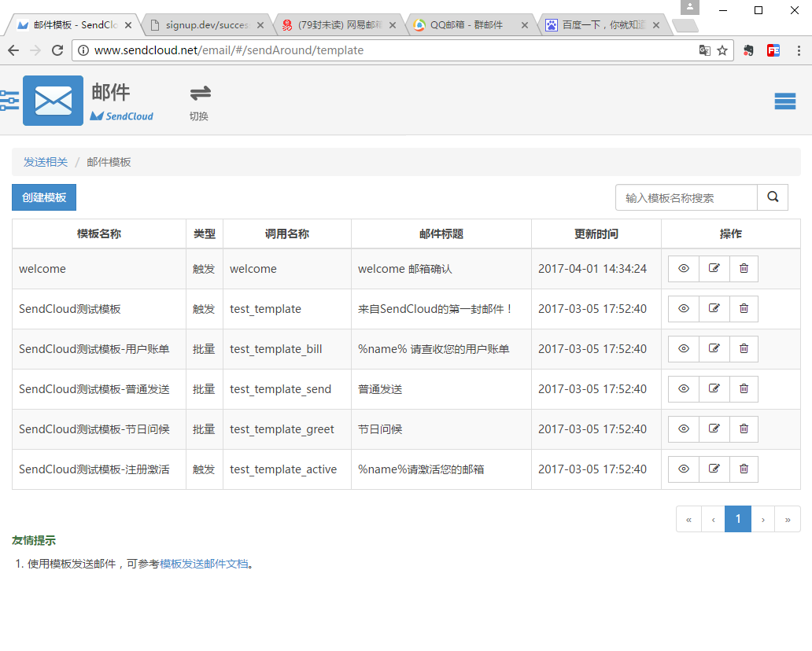
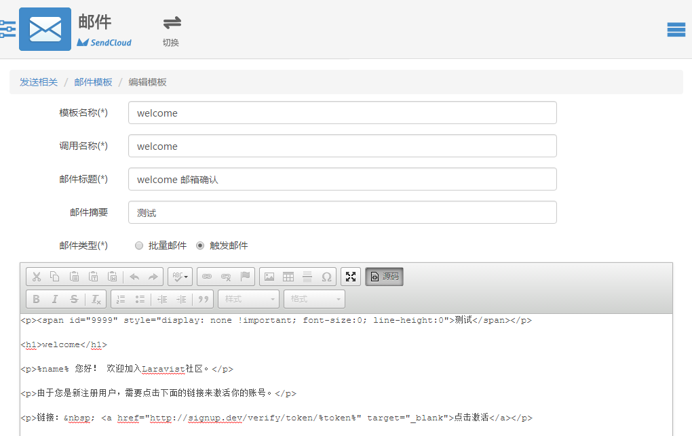

#集成 SendCould 邮件服务

注册SendCould账号，创建邮件模板





编辑模板 源码
```
<p><span id="9999" style="display: none !important; font-size:0; line-height:0">测试</span></p>

<h1>welcome</h1>

<p>%name% 您好！ 欢迎加入Laravist社区。</p>

<p>由于您是新注册用户，需要点击下面的链接来激活你的账号。</p>

<p>链接：&nbsp; <a href="http://signup.dev/verify/token/%token%" target="_blank">点击激活</a></p>
```

