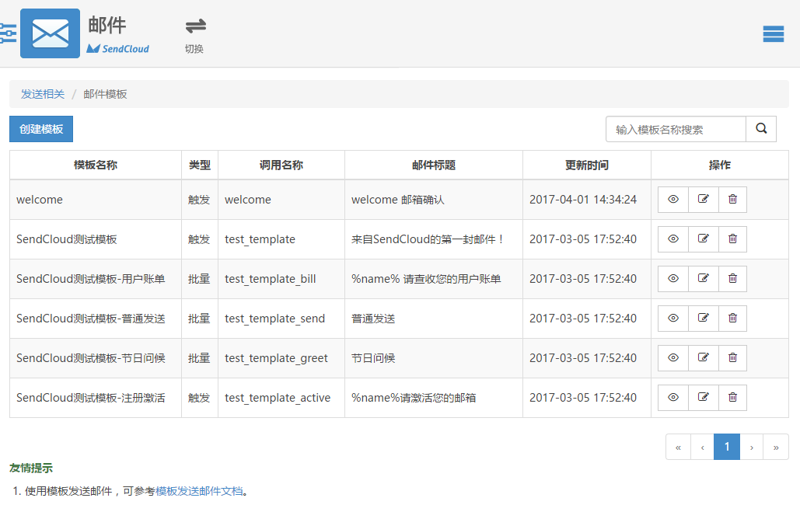

#集成 SendCould 邮件服务

.env
```
MAIL_DRIVER=smtp
MAIL_HOST=smtp.163.com
MAIL_PORT=465
MAIL_USERNAME=jiezeal@163.com
MAIL_PASSWORD=Internet678
MAIL_ENCRYPTION=ssl
MAIL_FROM_ADDRESS=jiezeal@163.com
MAIL_FROM_NAME='jiezeal'
SENDCLOUD_API_USER=zhulinjie_test_2vMozD
SENDCLOUD_API_KEY=jirEscO0Pr9Eoils
```

注册SendCould账号，创建邮件模板




编辑模板 源码
```
<p><span id="9999" style="display: none !important; font-size:0; line-height:0">测试</span></p>

<h1>welcome</h1>

<p>%name% 您好！ 欢迎加入Laravist社区。</p>

<p>由于您是新注册用户，需要点击下面的链接来激活你的账号。</p>

<p>链接：&nbsp; <a href="http://signup.dev/verify/token/%token%" target="_blank">点击激活</a></p>
```

SendCould继承到Laravel
参考文档：
>https://gist.github.com/JellyBool/9a518192c8ce6f325b8fcb09c93cdaac

app/Mailer/Mailer.php
```
protected $url = 'http://api.sendcloud.net/apiv2/mail/sendtemplate';

/**
 * @param $user
 * @param $subject
 * @param $view
 * @param array $data
 * @return string
 */
protected function sendTo($user, $subject, $view, $data = [])
{
    $vars = json_encode(['to' => [$user->email], 'sub' => $data]);
    $param = [
        'apiUser'            => env('SENDCLOUD_API_USER'), # 使用api_user和api_key进行验证
        'apiKey'             => env('SENDCLOUD_API_KEY'),
        'from'               => env('MAIL_FROM_ADDRESS'),  # 发信人，用正确邮件地址替代
        'fromName'           => env('MAIL_FROM_NAME'),
        'xsmtpapi'           => $vars,
        'subject'            => $subject,
        'templateInvokeName' => $view,
        'respEmailId'        => 'true'
    ];
    $sendData = http_build_query($param);
    $options = [
        'http' => [
            'method'  => 'POST',
            'header'  => 'Content-Type: application/x-www-form-urlencoded',
            'content' => $sendData
        ]];
    $context = stream_context_create($options);

    return file_get_contents($this->url, FILE_TEXT, $context);
}
```

app/Mailer/UserMailer.php
```
/**
 * @param $user
 */
public function welcome($user)
{
    $subject = 'welcome 邮箱确认';
    $view = 'welcome';
    $data = ['%name%' => [$user->name],'%token%' => [str_random(40)]];
    $this->sendTo($user, $subject, $view, $data);
}
```
